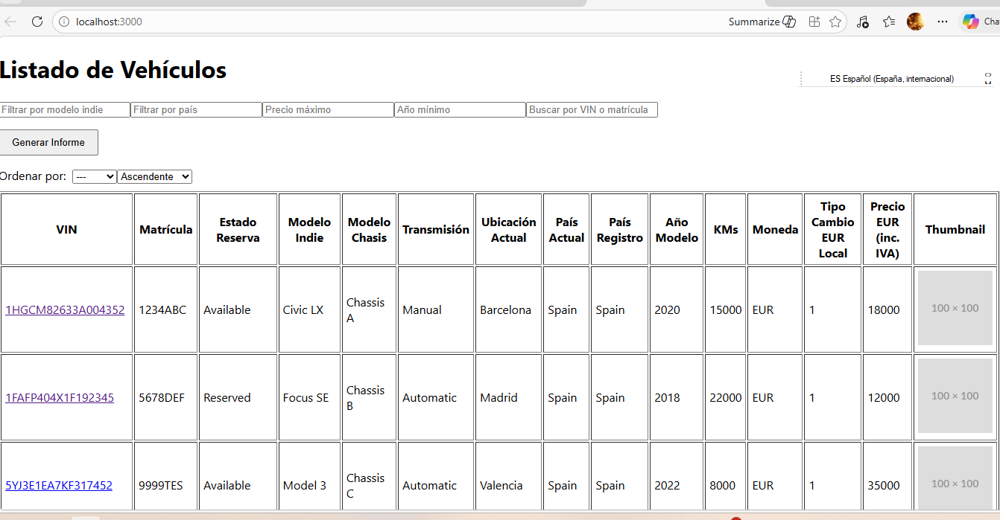
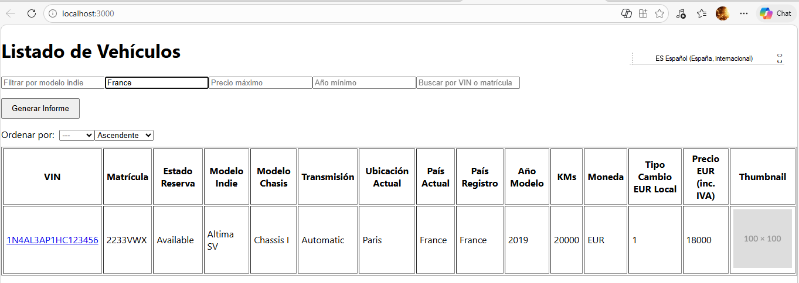

# Vehículos App (v1.2)

Aplicación **full-stack** para la gestión y visualización de vehículos disponibles para venta.

Permite **listar, filtrar, buscar y generar informes imprimibles** de vehículos de manera interactiva.

El **frontend está desarrollado en React** y el **backend en Java Spring Boot**.

---

# Estructura del proyecto

## Backend

Carpeta:

vehiculos-backend

Tecnologías:

- Java
- Spring Boot
- REST API

Endpoints principales:

GET /vehiculos  
→ Devuelve todos los vehículos en formato JSON.

Extensión posible:

GET /vehiculos/{vin}  
→ Devuelve el detalle de un vehículo (actualmente el filtrado se realiza en el frontend).

DTO:

Cada vehículo se representa mediante un objeto JSON proveniente de la clase:

VehiculoDTO

Branch / tag:

v1.0

---

## Frontend

Carpeta:

vehiculos-frontend

Tecnologías:

- React
- React Router
- Fetch API

Componentes principales:

VehiculosList.js  
→ Lista los vehículos, permite aplicar filtros y generar informe imprimible.

VehiculoDetalle.js  
→ Muestra el detalle completo de un vehículo.

Estado en React:

Se utiliza **useState** para manejar:

- modeloFiltro
- paisFiltro
- precioMaxFiltro
- anoMinFiltro
- búsqueda general (search)

La lista de vehículos se carga desde el backend y se guarda en:

vehiculos

Branch / tag:

v1.2

---

# Funcionalidades

## Listado y filtros

Visualización de todos los vehículos en formato tabla.

Filtros disponibles:

- Modelo Indie
- País
- Precio máximo
- Año mínimo

También incluye:

Búsqueda global por **VIN o matrícula**.

---

## Detalle de vehículo

Al hacer clic en el **VIN** se abre la página de detalle.

Información mostrada:

- VIN
- Matrícula
- Modelo
- Chasis
- Transmisión
- Kilometraje
- Año
- País actual
- Precio
- Imagen del vehículo

Las imágenes incluyen **fallback automático** si la miniatura no carga.

---

## Informe imprimible

La aplicación permite generar un **informe imprimible**.

Características:

- Solo incluye los vehículos que cumplen los filtros activos
- Formato de tabla listo para enviar a clientes
- Puede usarse como informe de ventas

---

# Detalles técnicos

- Cada fila de la tabla tiene un **key único** para evitar warnings de React.
- Las imágenes incluyen **onError fallback** a placeholder si la miniatura falla.
- Los datos se cargan desde una **API REST en Spring Boot**.

---

# Cómo ejecutar el proyecto

## Backend

```bash
cd vehiculos-backend
mvn spring-boot:run

## Screenshots

### Vehicle List


### Filters


### Vehicle Detail
